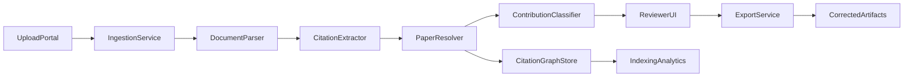

# Paper Reference Refactor System

## Goal

Create a system that helps authors and editors ensure each in-text citation points to the correct paper, uses the right citation style, is linked to the right author/paper identity, and emits clean structured metadata for downstream indexing and Scholar-style recalculation workflows.

## Recommended v1 Architecture

Use a web app with a human-in-the-loop review workflow.

## System Components

1. Frontend web app

- Upload manuscripts and reference assets.
- Show extracted citations, candidate matches, confidence, rationale, and suggested fixes.
- Let users approve, reject, or manually relink citations.
- Primary files to create: [frontend/package.json](frontend/package.json), [frontend/src/app/](frontend/src/app/), [frontend/src/components/](frontend/src/components/)

1. Backend API

- Manage uploads, jobs, parsing state, citation entities, review actions, and exports.
- Expose endpoints for manuscript ingestion, reference matching, reviewer decisions, and graph queries.
- Primary files to create: [backend/pyproject.toml](backend/pyproject.toml), [backend/app/main.py](backend/app/main.py), [backend/app/api/](backend/app/api/), [backend/app/services/](backend/app/services/)

1. Parsing and extraction pipeline

- Accept `LaTeX`, `BibTeX`, `PDF`, `Docx`, and metadata exports.
- Prefer deterministic parsers first:
  - `LaTeX/.bib`: parse citations, bibliography keys, and section context.
  - `Docx`: parse bibliography fields and inline references.
  - `PDF`: use structured extraction first, OCR/layout fallback only when needed.
- Normalize all outputs into one canonical citation schema.
- Primary files to create: [backend/app/services/ingest/](backend/app/services/ingest/), [backend/app/services/parsers/](backend/app/services/parsers/), [backend/app/schemas/citation.py](backend/app/schemas/citation.py)

1. Resolution and authority layer

- Use `Crossref + OpenAlex` as the main identity authority.
- Resolve each cited work to a canonical record: DOI, title, venue, year, author list, OpenAlex IDs, aliases.
- Build author identity confidence rather than trusting raw string matching.
- Cache external lookups and maintain provenance per field.
- Primary files to create: [backend/app/services/providers/crossref.py](backend/app/services/providers/crossref.py), [backend/app/services/providers/openalex.py](backend/app/services/providers/openalex.py), [backend/app/services/resolution/](backend/app/services/resolution/)

1. Contribution-aware citation classifier

- Determine why a citation is present in the current manuscript:
  - baseline method
  - dataset/benchmark
  - model architecture
  - theorem/proof prior work
  - implementation/tooling
  - negative/contrastive comparison
  - background survey
- v1 should combine rules plus model scoring:
  - rules from section title, citation surface form, nearby verbs, bibliography cues
  - embedding/reranker or LLM classifier for ambiguous cases
- Store label, confidence, and evidence spans for reviewer inspection.
- Primary files to create: [backend/app/services/classification/](backend/app/services/classification/), [backend/app/prompts/](backend/app/prompts/), [backend/app/features/](backend/app/features/)

1. Citation graph and analytics

- Maintain canonical nodes for papers, authors, and manuscripts.
- Maintain edges for `cites`, `mentions`, `compares_with`, `extends`, `uses_dataset`, `uses_method`.
- This graph becomes the source for indexing/export, auditing, and author impact recalculation.
- Primary files to create: [backend/app/db/models.py](backend/app/db/models.py), [backend/app/services/graph/](backend/app/services/graph/)

1. Export and interoperability

- Export corrected `BibTeX`, structured `JSON`, review reports, and graph snapshots.
- Keep a clear boundary: v1 should prepare clean indexed metadata and impact summaries, not claim direct Google Scholar mutation.
- Emit outputs suitable for downstream indexing/reconciliation systems.
- Primary files to create: [backend/app/services/export/](backend/app/services/export/), [docs/output-schema.md](docs/output-schema.md)

## Data Model

Define a canonical intermediate model early.

Core entities:

- `Manuscript`
- `CitationMention`
- `ReferenceEntry`
- `CanonicalPaper`
- `AuthorIdentity`
- `CitationDecision`
- `ContributionLabel`
- `ReviewAction`

Core relations:

- `CitationMention -> ReferenceEntry`
- `ReferenceEntry -> CanonicalPaper`
- `CanonicalPaper -> AuthorIdentity[]`
- `Manuscript -> CitationDecision[]`
- `CitationDecision -> ContributionLabel`

## Suggested Tech Stack

- Frontend: `Next.js` with TypeScript
- Backend: `FastAPI` + `Pydantic` + `SQLAlchemy`
- DB: `PostgreSQL`
- Queue: `Redis` + `RQ` or `Celery`
- Search/index: start with PostgreSQL trigram/full-text, add vector store only if matching quality requires it
- Parsing:
  - `bibtexparser` or equivalent for `.bib`
  - LaTeX AST/parser utilities
  - `python-docx` for `.docx`
  - structured PDF parser plus OCR fallback
- Models:
  - sentence embedding model for candidate retrieval
  - reranker/classifier for contribution intent

## Delivery Phases

1. Foundation

- Scaffold monorepo or `frontend/` + `backend/` split.
- Create canonical schemas, DB models, and ingestion job lifecycle.
- Add upload flow for mixed inputs.

1. Deterministic parsing

- Implement `LaTeX`, `.bib`, `Docx`, and basic `PDF` extraction.
- Normalize inline citations and bibliography entries.
- Persist evidence spans and parser provenance.

1. Authority resolution

- Integrate `Crossref` and `OpenAlex` providers.
- Implement candidate generation, scoring, canonical paper merge rules, and author identity confidence.
- Add caching and retry logic for provider rate limits.

1. Contribution classification

- Start with rules-based labels.
- Add embedding retrieval and model scoring for ambiguous cases.

1. Reviewer workflow

- Build citation review UI.
- Support manual relinking, label override, and audit trail.
- Show confidence and evidence snippets.

1. Export and graph analytics

- Generate corrected reference artifacts and graph snapshots.
- Produce manuscript-level reports: unresolved cites, duplicate refs, likely wrong attributions, author disambiguation risk.

## Quality Gates

- Parsing accuracy on gold examples by format.
- Resolution precision for top-1 canonical paper match.
- Author disambiguation precision for common-name cases.
- Contribution classification accuracy on manually labeled citation contexts.
- Reviewer time-to-approve and override rate.

## Risks To Address Early

- `PDF` citation extraction quality is much lower than `LaTeX/.bib`.
- Open metadata sources are imperfect for author disambiguation.
- “Fixing Scholar” must be framed as improving upstream metadata quality and export cleanliness, not controlling Scholar indexing directly.
- Contribution labels need evidence spans and reviewer override to avoid opaque model behavior.

## Proposed v1 Acceptance Criteria

- Upload mixed manuscript assets successfully.
- Extract inline citations and bibliography entries into canonical schema.
- Resolve most references to canonical `Crossref/OpenAlex` paper identities with confidence scores.
- Classify citation contribution types with reviewer-visible evidence.
- Allow reviewer approval/editing and export corrected outputs.
- Persist a citation graph suitable for downstream indexing and impact analytics.

## Initial File/Layout Plan

- [frontend/](frontend/)
- [backend/](backend/)
- [backend/app/api/](backend/app/api/)
- [backend/app/services/parsers/](backend/app/services/parsers/)
- [backend/app/services/providers/](backend/app/services/providers/)
- [backend/app/services/resolution/](backend/app/services/resolution/)
- [backend/app/services/classification/](backend/app/services/classification/)
- [backend/app/services/graph/](backend/app/services/graph/)
- [backend/app/services/export/](backend/app/services/export/)
- [docs/architecture.md](docs/architecture.md)
- [docs/output-schema.md](docs/output-schema.md)

## Build Strategy After Approval

1. Scaffold the app and API.
2. Implement the canonical schema and ingestion pipeline.
3. Add `Crossref/OpenAlex` resolution.
4. Build the first reviewer UI.
5. Add model-assisted classification and parsing fallback only where deterministic parsing falls short.
